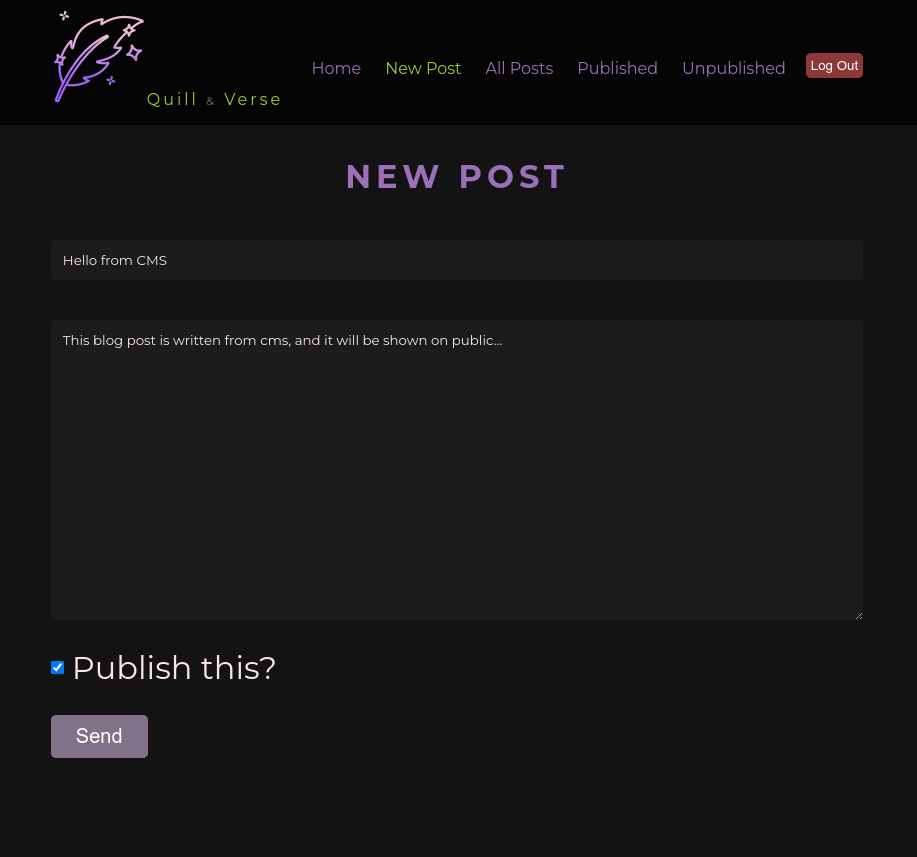

# Blog (Headless CMS)

MERN stack Blog project's headless CMS repository. Created with **React**. Deployed on [**Netlify**](https://netlify.app/).

⮕ [Live preview](https://mern-blog-headless-cms.netlify.app/)

---

`The login credentials: username: admin, password: 123456789`

---

This is the headless CMS part of the MERN Blog Project, The other parts are:

-   [**Back-end**](https://github.com/fatiharapoglu/blog-backend) Repository
-   [**Front-end**](https://github.com/fatiharapoglu/blog-frontend) Repository

---

## Features

-   CRUD operations on mongoDB database with admin authorization.
-   Comments for each post.
-   Snackbar feedback.
-   Rate limiter for users to comment.
-   Responsive design.

## Helper Dependencies

-   [Vite](https://vitejs.dev/) for starting environment and tooling
-   [Sass](https://sass-lang.com/) for SCSS
-   [Eslint](https://eslint.org/) for linting
-   [Prettier](https://prettier.io/) for formatting

## How It Looks

## Contact

⮕ [Portfolio](https://fatiharapoglu.dev)

⮕ [LinkedIn](https://www.linkedin.com/in/fatiharapoglu/)

## License

Distributed under the [MIT](https://choosealicense.com/licenses/mit/) License.
